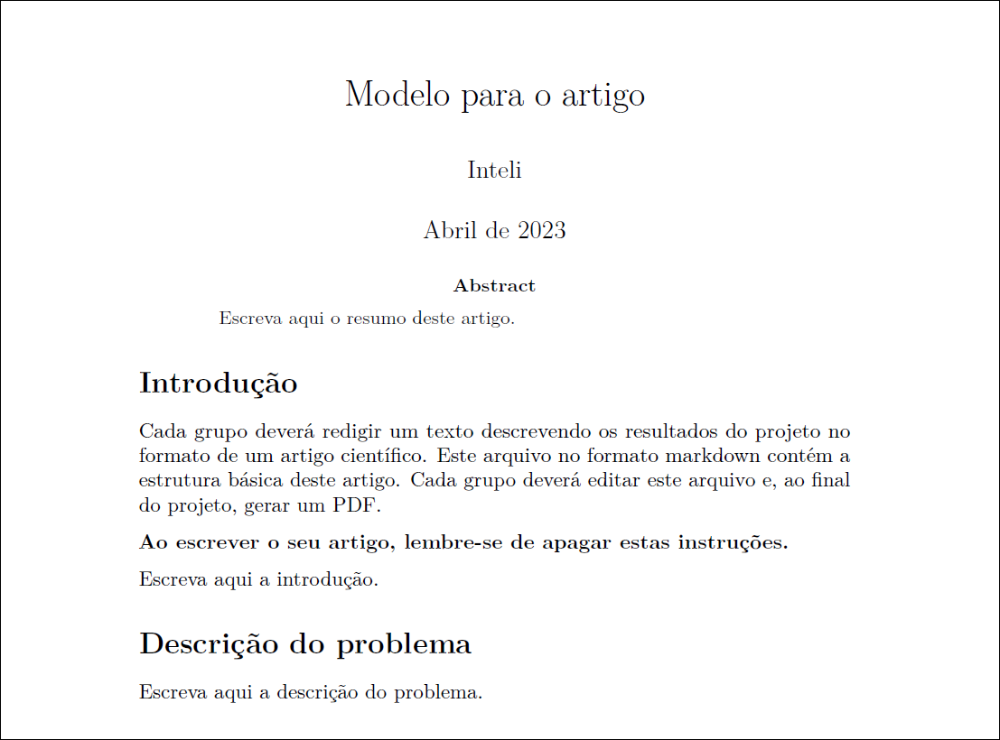

# Introdução

Cada grupo deverá redigir um texto descrevendo os resultados do projeto no formato de um artigo científico. Este arquivo no formato markdown contém a estrutura básica deste artigo. Cada grupo deverá editar este arquivo e, ao final do projeto, gerar um PDF (Figura 1).

**Ao escrever o seu artigo, lembre-se de apagar estas instruções.**

Escreva aqui a introdução.

# Motivação

Escreva aqui a motivação.

# Metodologia

Escreva aqui a metodologia.

# Trabalhos relacionados

Mencione e comente aqui alguns trabalhos relacionados a este.

# Descrição dos algoritmos adotados para resolver o problema

Descreva aqui os algoritmos utilizados para resolver o problema.

# Exemplo de fórmulas e expressões

A seguir temos a citação de alguns trechos de DASGUPTA et. al. (2011) para mostrar como estas notações são em $\LaTeX$. 

> Sejam $f(n)$ e $g(n)$ duas funções de inteiros positivos em reais positivos. Dizemos que $f = O(g)$ (que significa que "$f$ não cresce mais rápido do que $g$") se existe uma constante $c > 0$ tal que $f(n) \leq c \cdot g(n)$.

Ainda em outro trecho de DASGUPTA et. al. (2011), temos:

> Assim como $O(.)$ é análogo a $\leq$, podemos definir análogos de $\geq$ e $=$ como se segue:

> $f = \Omega(g)$ significa $g = O(f)$

As fórmulas e expressões também podem ser colocadas em linhas separadas. Exemplos:

$$f = \Omega(g)$$

e

$$g = O(f)$$

# Resultados obtidos

Coloque aqui os principais resultados obtidos.

# Conclusão

Escreva as principais considerações do grupo após a realização deste trabalho.

# Referências Bibliográficas

DASGUPTA, S.; Papadimitriou, C.; Vazirani, U. **Algoritmos.** Porto Alegre: AMGH, 2011. 1 recurso online. ISBN 9788563308535. Disponível em: https://integrada.minhabiblioteca.com.br/books/9788563308535. Acesso em: 17 jan. 2023.